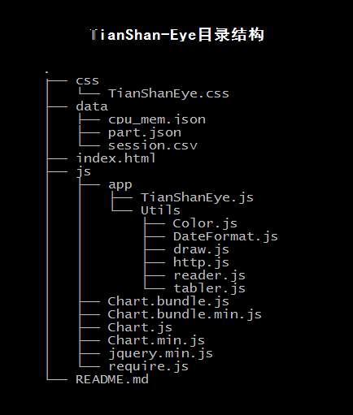

# 关于TianShanEye的相关说明

## 目录结构



- css: 样式表，主要用来控制table的样式
- data：测试数据，仅供测试
- index.html 主页
- js：控制代码
	- app
		- TianShanEye.js : 首先启动的js
		- Utils
			- Color.js  : 颜色选择控制
			- DateFormat.js : 设置date的格式化
			- draw.js  : 绘制图像（线性，饼状。。。）
			- http.js  : http-client 获取数据
			- reader.js : 读取本地文件
			- tabler.js : 绘制table
		- Chart.*.js : 第三方的图表绘制库
		- jquery.js
		- require.js :模块加载管理工具
- README.md 


## 主要分三个绘制模块

### 表格：类 table

- 构造: table(tableId,tableJson)
	- `tableId`   : html中table标签的id
	- `tableJson` : 要绘制的表格的数据源
- 创建: create()
- 更新: update(newtableJson)
	- `newtableJson`: 新的数据，用来覆盖原来表格上的数据
- 搜索: search(key,hide)
	- `key` ：在表中要搜索的关键字，找到会高亮显示该关键字，同时高亮显示该行
	- `hide`：是(true)否(fasle)隐藏出关键字的其他行
- 排序: sort(keyword,UorD)
	- `keyword` : 要排序的列的名称，注意这个可以被设置能否排序
				setSortCol([]) 输入的一个数组，控制可排序的列号，若为空表示全部都可以排序
	- `UorD`    : 升(true)降(false)序的控制
- csv: csv2json(csvdata)
	- `csvdata`: csv 格式的数据保存在一个string中，经过这个函数处理得到可以用来绘制table的json string
- 事件:
	- 行间事件(dbclick)
		- 高亮选中该行，目前没有相关操作(2017-3-2)
	- 单元格的事件(click)
		- `表头`: 按照可排序的字段进行升降序排列
		- `表体`: 可以获取点击单元格的数据，最后一个delete可以用于删除该行
		- `表尾`: 对于大型的表格用于扩展剩余的部分，最大每次扩展的行数保存在MaxRows中

### 绘图：类 render

```js
//Line 测试多组数据绘制在一张图的情况
var ctx1 = document.getElementById("canvas1").getContext("2d");
var data = []
var data2 = []
var data3 = []
var Render = new drawer.render(ctx1,"line",[data,data2,data3],["cpu","mem","bindwith"]);
Render.draw();
setInterval(function(){
	Render.update([reader.random(100),reader.random(100),reader.random(100)]);
},1000);

//pie 圆形图系列
// var CircleData = reader.readJson("/fvar/data/part.json");
var data2 = [
	["Sentry",45],
	["EventChannl",20],
	["EventGateWay",22],
	["RtspProxy",13],
	["EdgeFE",30],
	["MQTT",13]
]
var ctx2 = document.getElementById("part").getContext("2d");
var Render2 = new drawer.render(ctx2,"circle",data2,"server List");
Render2.draw();
Render2.update(["xxxx",35]);
Render2.update(["yyyy",37]);
Render2.update(["zzzz",37]);
```

- 构造: render(ctx,method,srcData,dataTitle,color,typeCircle)
	- `ctx`        : 绘图上下文，需要调用者提供 eg: var ctx1 = document.getElementById("canvasId").getContext("2d");
	- `method`     : 绘制图像类型: 线状图(line), 圆形图(circle);NOTE: 其中circle有 polarArea || pie || doughnut || bar 多种选择
	- `srcData`    : 一个二维数组，每一个元素即为一个数组，而这一组数据将是每一个图像的数据，即可以在一个canvas中绘制多条数据 NOTE: 即使输入的是一维数组也可以兼容
	- `dataTitle`  : 与srcData类似的，为每一组数据提供一个标题，如果没有设置将被初始化为Undefined
	- `color`      : 与srcData类似的，为每一组数据绘制提供一种颜色，如果没有设置将会在Color.js模块中获取指定的颜色
	- `typeCircle` : 只有在method为circle时才有意义,默认为doughnut
- 绘制: draw()
	- 根据render构造函数中的method 调用相应的绘制函数 drawLine 和 drawCircle
- 更新: update(Adata)
	- 对于 `line`
		- 是一个数组，其中每一个元素对应于srcData中每一组数据，注意是对应的，即
				Adata[0] 将被追加到srcData[0];Adata[1] 将被追加到srcData[1] 等等类似处理
			如果Adata中的数据与srcData中的数据不匹配，将有该数组最后一个数据替换补上，在界面上显示一条水平直线;
	- 对于 `circle`
		- 每一次更新将试图从color.js中获取一种颜色，绘制相应的比例部分
	- 以下均为私有函数,在构造函数设置好config 后只需要调用draw和update 即可，内部调用的是下面的函数
		- 线状图 `method = line`
			- drawLine()
			- lineUpdate()
		- 圆形图 `method = circle` `(polarArea || pie || doughnut || bar)`
			- drawCircle()

### 数据的获取: 类 Http

- 构造: http(config,locate)
	```js
	URL Example：
	0. http://ip:port/fvar/index.html
	1. http://ip:port/fvar/data/session.csv
	2. http://ip:port/svar/rtspProxy/0/rtspProxy-Statistics-Total-Succeeded-Request-Count?
	3. http://ip:port/mvar/ram?
	4. http://ip:port/mvar/ram?free

	config Example：
	- config = {
		way:"fvar",
		service:"data",           /*相当于路径目录，相对于index.html文件所在的路径*/
		varname:"session2.csv"    /*相当于文件名*/
	  }  <== 1
	- config = {
		way: "svar",
		service:"rtspProxy",      /*获取的服务程序名称*/
		instance:"0",             /*instance ID，暂时未0*/
		/*要获取的数据的变量名，详见ZQProjs/Common/snmp/mib2ctbl.cpp文件中的定义*/
		varname:"rtspProxy-Statistics-Total-Succeeded-Request-Count",
	  }  <== 2
	- config = {
		way: "mvar",
		service: "ram"           /*获取机器的相关数据，ram为内存，其他比如 cpu  nic*/
	  }  <== 3

	- config = {
		way: "mvar",
		service: "ram",          /*获取机器的相关数据，ram为内存，其他比如 cpu  nic*/
		varname: "free"          /*获取机器的相关数据，ram中的某个具体的值free*/  
	  }  <== 4

	locate: ip:port
		此处的locate是必须配置，在实例代码http.js中，添加的默认值仅为测试使用
	way:  控制获取的数据的方法：
		- svar: 获取Tianshan中服务的数据ZQSnmp模块处理
		- fvar: 获取文件
		- mvar: 获取主机的主要信息,如cpu  memory
	instance ：只有在svar中存在

	默认是 way: svar
	NOTE: 为了更好地兼容各种请求类型(fvar,svar,mvar),其中一些config的变量的名称没有统一，可能产生歧义，详细参考上面的实例
	此外，在服务端提供数据是请按照 最后部分《关于提供的数据格式规范》提供！
	```
- GET(success,fail)
	- success: callback function 如果GET成功，调用success
	- fail   : callback function 如果GET失败，调用fail
	- note： 如果调用GET的外层有定时器，建议实现fail回调函数，关闭定时器

### 必须要的工具

- 第三方:
	- require.js : 模块加载管理工具
	- chart.js   : canvas绘制依赖库
	- jquery.js  ：图表, http, file的处理工具
- 自定义工具:

|模块            |     |依赖      |
|:--------------:|:----|:-------:|
|Color.js        | =>  |null     |
|DateFormat.js   | =>  |null     |
|draw.js         | =>  |chart.js |
|http.js         | =>  |jquery.js|
|reader.js       | =>  |jquery.js|
|tabler.js       | =>  |jquery.js|

### 关于提供的数据格式规范

- 表格数据

	- 数据格式样例
	```json
	{
	/*表名*/"icTable": 
	    {
	/*列名*/"icIndex":  [/*数据*/6, 2, 3],
	/*列名*/"icIndex2": [/*数据*/2, 1, 5],
        ...
        }
	}
	```
	- 表名：整个表格的名称
	- 列名：每一个字段的名称
	- 数据：每一个字段的数据，或者说是记录
	- `注意：即使数据只有一个（记录数等于1）也要用括号包好，把它作为一个数组`

- 线状图数据
	- 数据样例
	```js
	var ctx1 = document.getElementById("cpu").getContext("2d");       //创建绘图上下文
	var data = []
	var data3 = []
	var data4 = []
	// 创建绘图类对象
	var Render = new drawer.render(ctx1,"line",[data,data3,data4],["cpu","mem","bindwith"]);
	Render.draw();
	// 定时器更新数据，绘制变化线
	setInterval(
		 function(){
			Render.update([reader.random(100),reader.random(100),reader.random(100)]);
		 },
	1000);
	```
	- 解释
		- 必须要创建绘图环境 ctx1
		- 必须创建绘图类对象 Render
		- 可以在一张canvas上绘制多个数据变化，所以在每次更新时也要提供相应的多个数据，如果数量不匹配，最后一个将被设置为最后一次更新后的值
		- 注意： 多个数据时 要用数组

- 饼状图数据
	- 数据格式样例
	```js
	var data2 = [
		["Sentry",45],
		["EventChannl",20],
		["EventGateWay",22],
		["RtspProxy",13],
		["EdgeFE",30],
		["MQTT",13]
	]
	```
	数组的每一个元素作为饼状图的一个扇面，占得的比例是内部数组的第二的值

- 详细请参考 js/app/TianShanEye.js